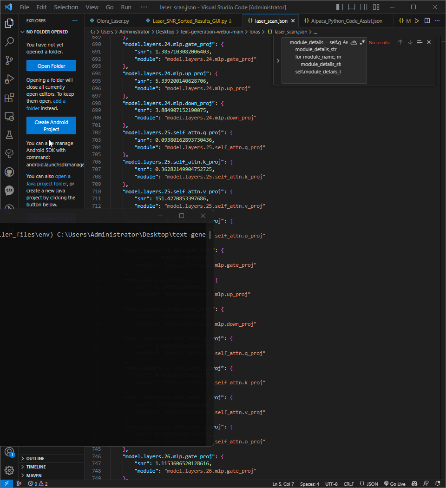

# SNR Analyzer Tool

The SNR Analyzer Tool, developed using PyQt5 in Python, assists in analyzing the performance of neural network layers by evaluating the signal-to-noise ratio (SNR). It enables users to select a JSON file containing SNR data, displays layers sorted by SNR, and provides detailed insights into each layer and its modules.

## Features:
- **Select JSON File:** Choose a JSON file with SNR data via a file dialog.
- **Display Sorted Layers:** Present layers in a list view, sorted from highest to lowest total SNR.
- **View Layer Details:** Access detailed information about each layer and its modules, including SNR values, by clicking on a specific layer.

## Usage:
1. Launch the application.
2. Click the "Select JSON File" button to designate a JSON file with SNR data.
3. Upon file selection, the tool showcases layers organized by SNR.
4. Click on a layer to delve into detailed module information and corresponding SNR values.

**Note:** Ensure the JSON file adheres to the correct format, including accurate module names and corresponding SNR values.

**Author:** [TroyDoesAI]

The SNR Analyzer Tool is designed to complement the optimization process of large language models (LLMs) using Layer-Selective Rank Reduction (LASER) and Random Matrix Theory (RMT), as proposed in the study "Optimizing Large Language Models Using Layer-Selective Rank Reduction and Random Matrix Theory" by Fernando Fernandes Neto, David Golchinfar, and Eric Hartford. By leveraging the principles outlined in the study, this tool provides users with the capability to analyze the performance characteristics of neural network layers. It enables users to identify potential areas for optimization and refine their language models more effectively.

For more information on LASER and RMT-based optimization techniques, please refer to the [GitHub repository](https://github.com/cognitivecomputations/laserRMT/tree/main) of the aforementioned study.

